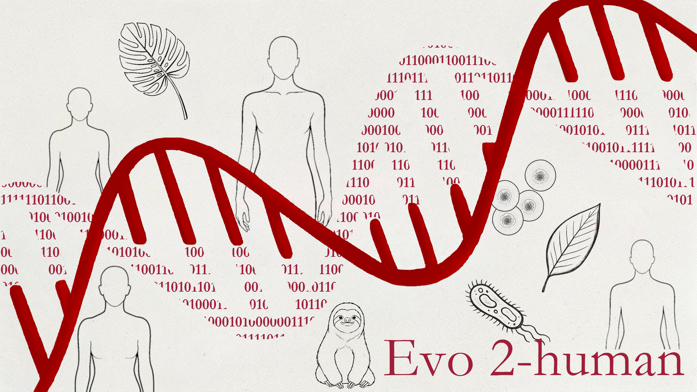
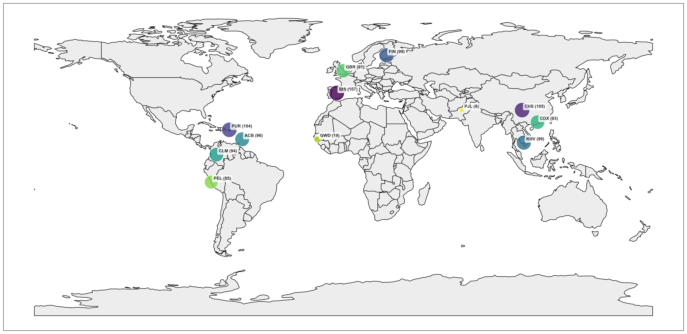

# Evo2-human: Fine-tuning Evo2 on Human DNA Sequences

> This banner was inspired by and adapted from the official [Evo 2 banner](github.com/ArcInstitute/evo2).

## Overview
Evo2-human is a project focused on fine-tuning the Evo2 foundation model using human DNA sequences sourced from the 1000 Genomes Project. The primary goal is to investigate the impact of this specialized fine-tuning on the model's capabilities, particularly for downstream tasks such as zero-shot Variant Effect Prediction (VEP). The project uses the BRCA dataset as a case study to evaluate the performance of the fine-tuned model in predicting the effects of genetic variants.

## This is a work in progress.
The project is still under active development, and the codebase is evolving. The model files and performance metrics are not yet finalized but are updated reguarly. The current focus is on establishing a robust pipeline for data acquisition, preprocessing, fine-tuning, and evaluation.

## Data
This project uses the 2013-05-02 release of the 1000 Genomes Project, providing a comprehensive set of human DNA sequences for fine-tuning. For detailed information on dataset composition and preprocessing steps, refer to [data/README.md](data/README.md).

</img>