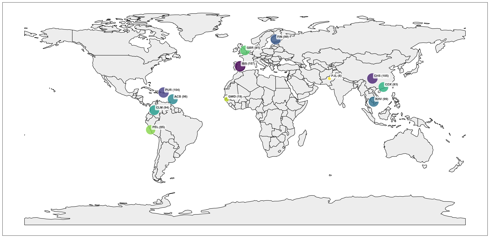

## BRCA Dataset
The `brca.csv` dataset is derived from [Findlay et al. (2018) ](https://www.nature.com/articles/s41586-018-0461-z), featuring experimentally measured functional scores for 3,893 BRCA1 single nucleotide variants (SNVs). Each SNV is categorized by its functional score into one of three groups: LOF (loss-of-function), INT (intermediate), or FUNC (functional).

## GRCh37 p13 Reference Sequence
The chromosome 17 reference genome (`GRCh37.p13_chr17.fna.gz`) is sourced from the February 2009 Homo sapiens high-coverage assembly GRCh37 by the [Genome Reference Consortium ](https://www.ncbi.nlm.nih.gov/grc).
This reference is used exclusively for the zero-shot prediction of BRCA1 variants.

## Phenotype Data
The `phenotypes.csv` dataset is derived from the phase 3 release of the [1000 Genomes Project panel](https://ftp.1000genomes.ebi.ac.uk/vol1/ftp/release/20130502/integrated_call_samples_v3.20130502.ALL.panel).

### Population Distribution Analysis

The following visualizations summarize key demographic information from the 1000 Genomes Project:

- **Population by Super Population**  
    

- **Gender by Super Population**  
    

- **Population Map**  
    

For additional details, visit the [1000 Genomes Project Collection at Coriell](https://www.coriell.org/1/NHGRI/Collections/1000-Genomes-Project-Collection/1000-Genomes-Project).
